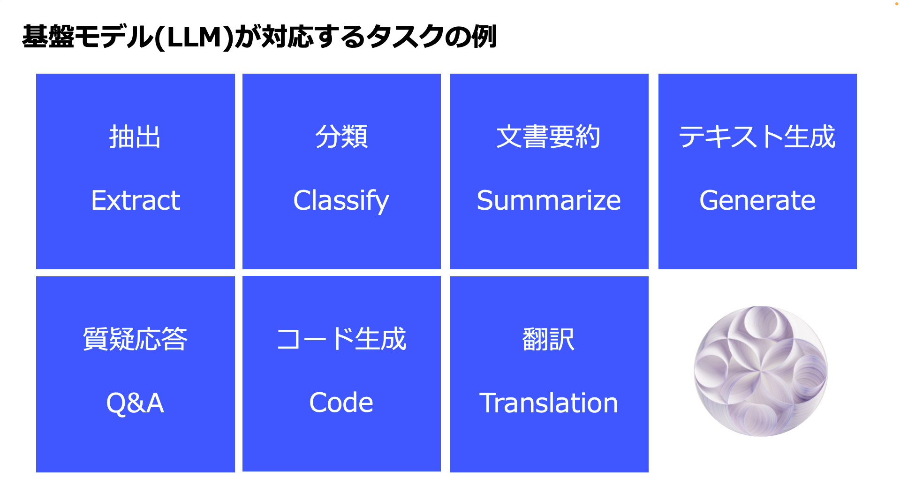
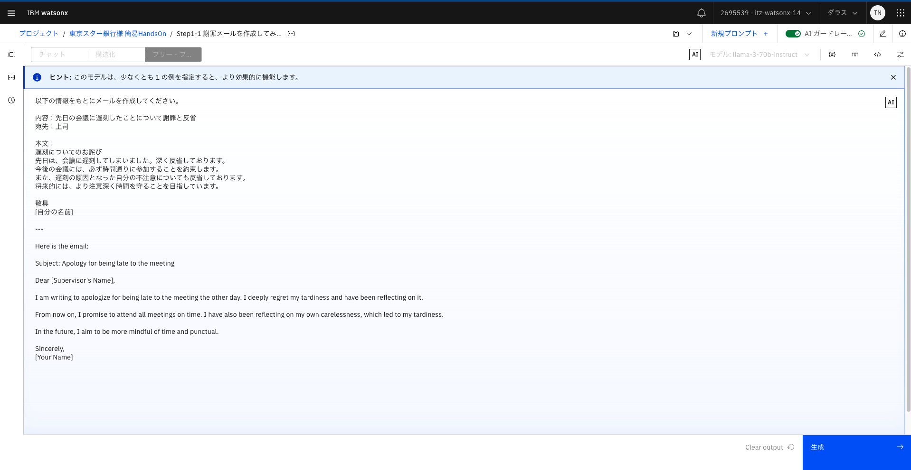
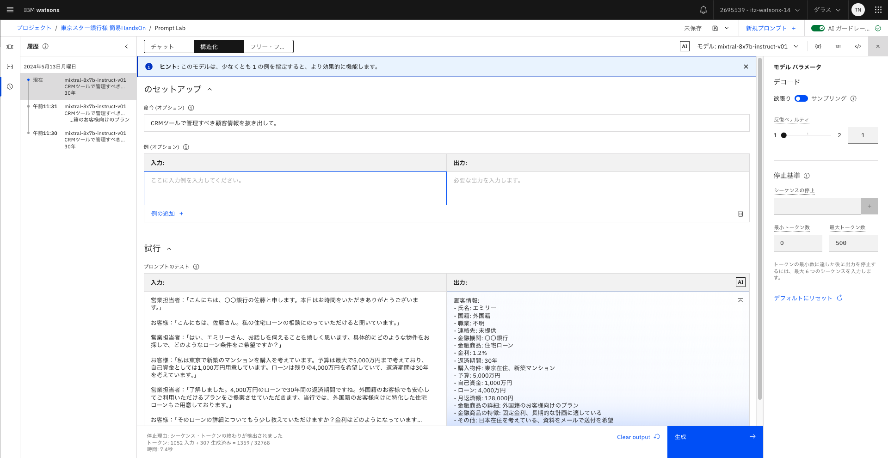

# watsonx.aiハンズオン
## はじめに
このハンズオンは、参加者が直接生成AIを操作することにより、その実用性と価値をご理解いただくことを目的としています。
このハンズオンに必要な環境は以下の通りです。
- IBM Cloudアカウント
- TechZoneサービス環境（無料）

## ハンズオンで実施するタスク


基盤モデルは大きく`7`つのタスクに対応することができます。
本ハンズオンでは下記`3`つのタスク例をもとに、watsonx.aiを体験いただきます。

- テキスト生成
- 文書要約
- 抽出

## Step1 - テキスト生成

### Step1-1 謝罪メールを作成してみよう


**プロンプト例**
```
以下の情報をもとにメールを作成してください。

内容：先日の会議に遅刻したことについて謝罪と反省 
宛先：上司

本文：
遅刻についてのお詫び
```

**出力例（モデル パラメータにより出力は異なります。）**
```
先日は、会議に遅刻してしまいました。深く反省しております。
今後の会議には、必ず時間通りに参加することを約束します。
また、遅刻の原因となった自分の不注意についても反省しております。
将来的には、より注意深く時間を守ることを目指しています。
（英文出力省略）
```

### Step1-2 より丁寧な謝罪メールを作成してみよう
**プロンプト例**
```
以下の情報をもとにできるだけ丁寧なメールを作成してください。

内容：先日の会議に遅刻したことについて謝罪と反省 
宛先：上司

本文：
遅刻についてのお詫び
```

**出力例（モデル パラメータにより出力は異なります。）**
```
先日、会議に遅刻してしまったことを深くお詫び申し上げます。
私たちは、時間を大切にするべきであると常に考えており、遅刻することは許されないと考えています。
しかし、私はその原則を破ってしまったことを深く反省しています。
今後の会議には、必ず時間通りに到着することを約束します。
また、私の遅刻が会議の進行に影響を与えた場合、申し訳ございません。
今後は、時間をより大切にすることを心に刻み、遅刻することを避けるために努力します。
（英文出力省略）
```

### Step1-3 住宅ローンの紹介メールを作成してみよう

**プロンプト例**
```
以下の情報をもとにメールを作成してください。

内容：永住権をお持ちでない外国籍のお客様にご利用いただける住宅ローンの紹介
宛先：佐藤太郎

本文：
```
**出力例（モデル パラメータにより出力は異なります。）**
```
佐藤太郎様

当社では、永住権をお持ちでない外国籍のお客様にも住宅ローンをご提供しております。
このローンは、外国籍のお客様のニーズに合わせて設計されており、柔軟な返済条件や低金利など、多くのメリットをご提供しています。
お住まいの夢を実現するためのお手伝いをさせていただきます。

詳しくは、当社のウェブサイトをご覧ください。
また、当社の担当者までお問い合わせください。
（英文出力省略）
```

## Step2 - 文書要約
### Step2-1 通話記録を要約してみよう

**プロンプト例**
```
以下の会話内容を要約してください。


通話記録
営業担当者: こんにちは、[銀行名]の[担当者名]です。先日お問い合わせいただいた教育ローンについて、ご相談のお時間をいただきありがとうございます。お子様の進学に関する資金計画をお手伝いできればと思いますが、具体的なご希望や条件を教えていただけますか？

お客様: こんにちは、そうですね、私の息子が来年から大学に通うことになりまして、その学費のためのローンを考えています。学費としては年間で約200万円、4年間で800万円ほどが必要です。

営業担当者: 了解いたしました。年間200万円、合計で800万円の教育ローンですね。当銀行では、教育ローンに特化したプランがいくつかございます。例えば、低金利の固定金利プランや、学生本人ではなく親御さんが借り入れる親ローンなど、さまざまな選択肢をご提供しています。特に親ローンの場合、金利優遇措置があり、返済期間もフレキシブルに設定することが可能です。

お客様: 金利はどのくらいですか？また、返済期間についても教えてください。

営業担当者: 現在、教育ローンの固定金利は年間で約3%から始まります。返済期間は最長で10年まで設定可能ですが、お客様のご希望に応じて、例えば学業終了後から返済開始というような条件も設定できます。これにより、卒業後にお子様が就職されてから返済を開始することも可能です。

お客様: それは良いですね。息子が自分で返済を始めることも考えているので、卒業後の返済開始は魅力的です。

営業担当者: それは素晴らしいご計画ですね。それに、当銀行の教育ローンでは、返済開始前に金利が変動する心配がないため、計画的に資金管理を行うことができます。さらに、ローンの事前審査を通過すれば、特別な書類手続きなしに年間の学費を直接大学に送金するサービスも提供しています。

お客様: それは助かります。では、その条件で申し込みたいのですが、次はどうすればいいですか？

営業担当者: 次にすることは、オンラインでの申込み手続きまたは当行の支店で直接お手続きいただくことになります。お客様のご都合の良い方法をお選びいただけます。申込みフォームをメールで送付させていただくこともできますし、必要であれば、さらなる詳細をご説明するためにもう一度お会いしても良いでしょう。

お客様: メールでの申込みフォーム送付をお願いします。それから、確認するためにもう一度話し合いたいです。

営業担当者: 了解しました。申込みフォームを本日中にお送りします。また、再度のご相談の日程も調整いたしましょう。今日はお電話いただきありがとうございました。また何かご不明な点がございましたら、いつでもお気軽にご連絡ください。

お客様: ありがとうございます。助かりました。


要約結果
```

**出力例（モデル パラメータにより出力は異なります。）**
```
この会話は、銀行の営業担当者とお客様との電話会話です。お客様は息子が大学に通うための教育ローンについて相談しています。銀行の営業担当者は、教育ローンのプランや金利、返済期間について説明し、お客様のニーズに応じた条件を提示しています。お客様は、卒業後の返済開始や金利の固定化などを魅力的と考えており、申込み手続きを進めたいと表明しています。


(出典: 本文は、架空の会話内容を基にして作成されたものです)
```

## Step3 - 抽出
### Step3-1 顧客興味を抽出してみよう

**プロンプト例**
```
以下の会話内容から下記情報を抽出してください。

- 顧客の興味関心事項
- 教育ローンに対する反応
- フォローアップの必要性


通話記録
営業担当者: こんにちは、[銀行名]の[担当者名]です。先日お問い合わせいただいた教育ローンについて、ご相談のお時間をいただきありがとうございます。お子様の進学に関する資金計画をお手伝いできればと思いますが、具体的なご希望や条件を教えていただけますか？

お客様: こんにちは、そうですね、私の息子が来年から大学に通うことになりまして、その学費のためのローンを考えています。学費としては年間で約200万円、4年間で800万円ほどが必要です。

営業担当者: 了解いたしました。年間200万円、合計で800万円の教育ローンですね。当銀行では、教育ローンに特化したプランがいくつかございます。例えば、低金利の固定金利プランや、学生本人ではなく親御さんが借り入れる親ローンなど、さまざまな選択肢をご提供しています。特に親ローンの場合、金利優遇措置があり、返済期間もフレキシブルに設定することが可能です。

お客様: 金利はどのくらいですか？また、返済期間についても教えてください。

営業担当者: 現在、教育ローンの固定金利は年間で約3%から始まります。返済期間は最長で10年まで設定可能ですが、お客様のご希望に応じて、例えば学業終了後から返済開始というような条件も設定できます。これにより、卒業後にお子様が就職されてから返済を開始することも可能です。

お客様: それは良いですね。息子が自分で返済を始めることも考えているので、卒業後の返済開始は魅力的です。

営業担当者: それは素晴らしいご計画ですね。それに、当銀行の教育ローンでは、返済開始前に金利が変動する心配がないため、計画的に資金管理を行うことができます。さらに、ローンの事前審査を通過すれば、特別な書類手続きなしに年間の学費を直接大学に送金するサービスも提供しています。

お客様: それは助かります。では、その条件で申し込みたいのですが、次はどうすればいいですか？

営業担当者: 次にすることは、オンラインでの申込み手続きまたは当行の支店で直接お手続きいただくことになります。お客様のご都合の良い方法をお選びいただけます。申込みフォームをメールで送付させていただくこともできますし、必要であれば、さらなる詳細をご説明するためにもう一度お会いしても良いでしょう。

お客様: メールでの申込みフォーム送付をお願いします。それから、確認するためにもう一度話し合いたいです。

営業担当者: 了解しました。申込みフォームを本日中にお送りします。また、再度のご相談の日程も調整いたしましょう。今日はお電話いただきありがとうございました。また何かご不明な点がございましたら、いつでもお気軽にご連絡ください。

お客様: ありがとうございます。助かりました。


抽出結果
```

**出力例（モデル パラメータにより出力は異なります。）**
```
- 顧客の興味関心事項：息子の大学進学のための学費の資金計画
- 教育ローンに対する反応：金利や返済期間、卒業後の返済開始の条件に好感を示し、ローンの事前審査や特別な書類手続きなしのサービスに助かりを感じている
- フォローアップの必要性：オンラインでの申込み手続きや支店での直接お手続き、さらなる詳細の説明や確認のための再度の会話の必要性があるため、フォローアップが必要である。
```

### Step3-2 構造化モードでのプロンプティング
watsonx.aiでは、基盤モデルに対する指示を整理して構造化したり、モデルのパラメータを調整して出力内容を制御することもできます。これにより、ビジネスのニーズに合わせてカスタマイズされた解決策を提供することが可能です。

**モデルパラメータ**
- デコード：モデルがテキストを生成する際、どのように生成するかを制御
  - 欲張り：正確に生成
  - サンプリング：創造的に生成
- 反復ペナルティ：生成されたテキスト内で同じ内容が繰り返し出てくるのを制御
- 停止基準
  - シーケンスの停止：指定した文字列が生成された場合、自動的に出力を停止
  - トークン数：生成されるトークン数（≒文字数）を制御



**命令**
```
CRMツールで管理すべき顧客情報を抜き出して。
```

**試行/入力**
```
営業担当者：「こんにちは、〇〇銀行の佐藤と申します。本日はお時間をいただきありがとうございます。」

お客様：「こんにちは、佐藤さん。私の住宅ローンの相談にのっていただけると聞いています。」

営業担当者：「はい、エミリーさん、お話しを伺えることを嬉しく思います。具体的にどのような物件をお探しで、どのようなローン条件をご希望ですか？」

お客様：「私は東京で新築のマンションを購入を考えています。予算は最大で5,000万円まで考えており、自己資金としては1,000万円用意しています。ローンは残りの4,000万円を希望していて、返済期間は30年を考えています。」

営業担当者：「了解しました。4,000万円のローンで30年間の返済期間ですね。外国籍のお客様でも安心してご利用いただけるプランをご提案させていただきます。当行では、外国籍のお客様向けに特化した住宅ローンもご用意しております。」

お客様：「そのローンの詳細についてもう少し教えていただけますか？金利はどのようになっていますか？」

営業担当者：「もちろんです。現在、外国籍のお客様向けのプランでは、固定金利1.2%で提供しています。これは返済期間全体を通じて同じ金利が適用されるため、将来の金利の変動リスクを心配する必要がありません。」

お客様：「それは良いですね。返済額は月にどれくらいになりますか？」

営業担当者：「4,000万円を30年間で返済する場合、月々の返済額は約128,000円になります。これには元金と利息が含まれています。」

お客様：「了解しました。私はこれからも日本での生活を考えていますので、安定した長期的な計画が重要です。このプランについて、書面での詳細もいただけますか？」

営業担当者：「もちろんです、エミリーさん。資料をメールでお送りいたします。それに加えて、書類に必要な情報や手続きについても詳しくご説明いたします。」

お客様：「ありがとうございます、佐藤さん。書類を確認して、また何か質問があれば連絡します。」

営業担当者：「はい、何かご不明な点がございましたらいつでもお問い合わせください。今日はお時間をいただき、ありがとうございました。」
```


## まとめ
生成AIは、多岐にわたるユースケースで組織のタスクと業務を簡素化し、効率的かつ迅速に作業を進められるようにします。例えば、リテールバンキング営業においては、顧客との電話記録から生成AIを利用して重要な顧客情報を抽出し、CRMシステムを効率的に更新することができます。これにより、担当者間のスムーズな情報の引き継ぎや、次回の営業活動のための準備が容易になります。